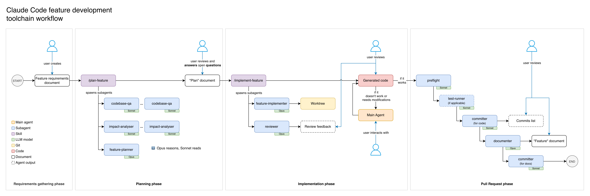

# Documentation

> Start here. This README explains what lives in `docs/`, how it connects to the `.claude/` toolchain and `CLAUDE.md`, and where to go depending on what you need.

---

## How it all fits together

```
CLAUDE.md                  ← Project-specific config: architecture, commands, conventions, reuse rules
.claude/                   ← Portable AI toolchain: agents, commands, skills, hooks
  hooks/config.sh          ← Shell variables (vendor namespace, React paths) — the only file needing edits per project
docs/                      ← This folder — living documentation that agents read and write during feature work
  manuals/                 ← Workflow guides, playbooks, reference, and architecture concepts
  plans/                   ← Implementation plans (input for @feature-implementer)
  features/                ← Architecture documents for completed features
  requirements/            ← Jira tickets and spec documents (input for @feature-planner)
  prompts/                 ← Reusable prompts for setting up the toolchain in new projects
```

**CLAUDE.md** is the single source of truth for project-specific data. The `.claude/` tools (agents, commands, skills) and `docs/manuals/` all reference it dynamically rather than hardcoding values — this is what makes the entire system portable across Magento projects.

---

## I need to...

### Work on this project


| Goal                                         | Where to go                                                                                                      |
| -------------------------------------------- | ---------------------------------------------------------------------------------------------------------------- |
| Get oriented in this repo                    | `[manuals/00-getting-started/onboarding.md](manuals/00-getting-started/onboarding.md)`                           |
| Plan and deliver a feature                   | `[manuals/01-workflows/feature-development.md](manuals/01-workflows/feature-development.md)`                     |
| Debug something broken                       | `[manuals/02-playbooks/debugging.md](manuals/02-playbooks/debugging.md)`                                         |
| Explore unfamiliar code                      | `[manuals/02-playbooks/exploration-and-investigation.md](manuals/02-playbooks/exploration-and-investigation.md)` |
| Look up an agent, command, or skill          | `[manuals/03-reference/ai-tools-reference.md](manuals/03-reference/ai-tools-reference.md)`                       |
| Understand an architecture decision          | `[manuals/05-concepts/](manuals/05-concepts/)` — one topic per file                                              |
| Read the plan for a feature in progress      | `plans/` — one file per planned feature                                                                          |
| Understand a completed feature's design      | `features/` — architecture documents with Mermaid diagrams                                                       |
| Read the original requirements for a feature | `requirements/` — Jira exports and spec documents                                                                |


### Set up this toolchain in a new project


| Step | Prompt                                                                                                     | What it does                                                                                                            |
| ---- | ---------------------------------------------------------------------------------------------------------- | ----------------------------------------------------------------------------------------------------------------------- |
| 1    | `[prompts/generate-claude-md-for-new-project.md](prompts/generate-claude-md-for-new-project.md)`           | Scans the new repo and generates a `CLAUDE.md` with all required sections that the `.claude/` tools expect              |
| 2    | `[prompts/review-claude-toolchain-for-new-project.md](prompts/review-claude-toolchain-for-new-project.md)` | Reviews `.claude/` against the new CLAUDE.md, updates `hooks/config.sh`, validates compatibility, and produces a report |


After running both prompts, copy `docs/manuals/` to the new project — the manuals are fully generic and reference CLAUDE.md for project-specific values.

---

## Folder reference

### `manuals/`

Workflow guides, playbooks, reference docs, and architecture concepts for using the `.claude/` toolchain effectively. These are **project-portable** — all project-specific values are resolved from CLAUDE.md at runtime.

See `[manuals/README.md](manuals/README.md)` for the full folder map and quick lookup table.

**Maintained by:** the `sync-manuals-check.sh` hook automatically prompts documentation updates whenever `.claude/` tooling files or `CLAUDE.md` are modified.

### `plans/`

Implementation plans produced by the `@feature-planner` agent. Each file represents a planned feature with a file-by-file breakdown, risk assessment, and implementation checklist.

**Naming convention:** `TICKET-XXX-feature-name.md`

**Workflow:**

1. Drop requirements into `requirements/`
2. Run `/plan-feature` — it orchestrates research and writes a plan here
3. Review and refine the plan (resolve open questions)
4. Run `/implement-feature` with the plan file as input

Plans are living documents — update them if scope changes during implementation.

### `features/`

Architecture documents for completed features. Each document includes Mermaid diagrams, data flow sequences, admin configuration paths, and deployment steps.

**Naming convention:** `TICKET-XXX-feature-name.md`

**When to create:** After implementing a multi-layer feature, before creating the PR. Run `@documenter TICKET-XXX` to generate the document. The `@committer` agent reminds you if one is missing.

**Why it matters:** Without these documents, future developers and AI agents must re-read every file to understand a feature's design. The architecture document provides the map.

### `requirements/`

Jira ticket exports, spec documents, and acceptance criteria. Drop files here before running `@feature-planner` — the planner reads this folder to understand scope.

**Supported formats:** XML exports, text files, markdown.

### `prompts/`

Reusable prompts for bootstrapping the `.claude/` toolchain in new Magento projects. These are not used during daily development — they are used once when setting up a new project.


| Prompt                                       | Purpose                                                                                                                                                                                    |
| -------------------------------------------- | ------------------------------------------------------------------------------------------------------------------------------------------------------------------------------------------ |
| `generate-claude-md-for-new-project.md`      | Generates a CLAUDE.md with all sections that agents, commands, and skills expect. Includes a 20-step discovery process and quality checks.                                                 |
| `review-claude-toolchain-for-new-project.md` | Validates the `.claude/` toolchain against the new CLAUDE.md. Updates `hooks/config.sh`, checks hook assumptions, cross-references tool dependencies, and produces a compatibility report. |


**Order matters:** Always run `generate-claude-md` first, then `review-claude-toolchain` second.

---

## Workflow for implementing a feature

This is the end-to-end process for delivering a feature using the `.claude/` toolchain. Each step uses a specific agent or manual action, and `docs/` folders act as the handoff points between phases.

For the full detailed guide with flowcharts and slash command inventory, see `[manuals/01-workflows/feature-development.md](manuals/01-workflows/feature-development.md)`.



**Model principle — "Opus reasons, Sonnet reads":** Research and mechanical agents run on Sonnet (fast, cost-efficient). Reasoning-heavy agents run on Opus (higher quality).

### Step 1 — Gather requirements

Save the Jira ticket export, spec document, or acceptance criteria into `docs/requirements/`. Supported formats: PDF, XML, text, markdown. The planner agent reads from this folder.

### Step 2 — Plan

```
/plan-feature [requirements file path, ticket number, or feature description]
```

The `/plan-feature` command orchestrates three phases from the main conversation:

1. Spawns **2–5 `codebase-qa` sub-agents** in parallel to research how reference features implement the patterns needed
2. Spawns **1–3 `impact-analyser` sub-agents** in parallel to assess what existing code will be affected
3. Passes all findings to the `**@feature-planner`** agent, which synthesizes them into a file-by-file implementation plan at `docs/plans/TICKET-XXX-feature-name.md`

**Before moving on — comprehension checkpoint:** Don't just scan for `TBD`/`TODO` markers. Verify that you can explain the feature's data flow end-to-end: how user input enters the frontend, crosses to the backend via GraphQL, gets processed, and returns a result. If you can't trace this from the plan alone, use `@codebase-qa` to fill gaps before running the implementer. Approving a plan you don't understand is the fastest path to comprehension debt (see `docs/manuals/05-concepts/knowledgebase-comprehension-debt.md`).

### Step 3 — Implement and review

```
/implement-feature docs/plans/TICKET-XXX-feature-name.md
```

The `/implement-feature` skill orchestrates the full implementation workflow:

1. **Validates the plan** — checks for unresolved open questions (`TODO`, `TBD`, `?` markers)
2. **Spawns `@feature-implementer`** (Opus) in an isolated git worktree — writes all code, runs type-check/lint/build, produces a change summary
3. **Spawns `@reviewer`** (Opus) — detects whether the worktree still exists or changes landed in the main working directory, and reviews accordingly
4. **Reports combined results** — change summary, verification results, checklist progress, code review findings, and key files to understand

The review feedback is **informational output for the user** — it does not trigger automated fixes. You decide which findings to address and how.

**Comprehension checkpoint:** Read the key files listed in the output — these are the 3–5 files that define the feature's primary data flow. Trace the flow yourself: user action → frontend → GraphQL → backend → side effects. The review checks for correctness, but only you can verify that you understand what was built.

### Step 4 — Iterate manually (if needed)

If the review or your own inspection reveals issues — incorrect logic, missing edge cases, patterns violations — fix them manually or with targeted slash commands (e.g. `/plugin`, `/react-gql`, `/email-template`). This is normal; the implementer handles the bulk of the work, but complex features often need human refinement.

### Step 5 — Quality checks

```
@preflight
```

Runs the full quality suite across both layers: ESLint, TypeScript type-check, Vite production build, focused a11y audit on changed components, PHPCS, and PHPStan. Fix any reported issues before proceeding.

For faster iteration on one stack:

```
/react-preflight   # React-only checks
/php-preflight     # PHP-only checks
```

### Step 6 — Run tests (if applicable)

```
@test-runner changed
```

Runs tests for changed files only. If no test infrastructure exists yet, this step can be skipped — but consider running `/react-add-tests setup` to bootstrap Vitest for future work.

### Step 7 — Commit

```
@committer
```

The committer analyses all uncommitted changes, reads modified files to understand their layer, and proposes a logical breakdown into ordered commits following the project's commit conventions (from CLAUDE.md → Commit Conventions). Review the proposed plan, then reply `"go"` to execute.

**Do not push yet** — documentation comes first.

### Step 8 — Document

```
@documenter TICKET-XXX
```

Generates an architecture document at `docs/features/TICKET-XXX-feature-name.md` with Mermaid diagrams, module structure, data flows, admin configuration paths, and deployment steps. Review the output and resolve any `[TODO: verify]` items.

**This step is mandatory for multi-layer features.** Without the architecture document, future developers and AI agents have no way to understand the feature's design without re-reading every file.

**Final comprehension checkpoint:** Read the generated architecture document as a quiz — does the diagram match your understanding? Can you follow the sequence diagram without surprises? Any mismatch between the doc and your mental model is a comprehension gap to investigate before creating the PR.

### Step 9 — Commit documentation

```
@committer
```

Run the committer again to commit the architecture document as the final commit on the branch. This keeps documentation commits separate from code commits.

### Step 10 — Create PR

Create the pull request manually (or via `gh pr create`). The architecture document in `docs/features/` gives reviewers the context they need to understand the full design without reading every file in the diff.

---

### How `docs/` connects the steps


| Folder          | Written by                | Read by                        | Purpose in the workflow                |
| --------------- | ------------------------- | ------------------------------ | -------------------------------------- |
| `requirements/` | Developer (manual)        | `@feature-planner`             | Input: what to build                   |
| `plans/`        | `@feature-planner`        | `@feature-implementer`         | Handoff: how to build it               |
| `features/`     | `@documenter`             | Future developers, AI agents   | Output: how it was built               |
| `manuals/`      | Maintained with toolchain | Developers, AI agents          | Reference: how to use the tools        |
| `prompts/`      | Maintained with toolchain | Developers (new project setup) | Bootstrap: how to set up the toolchain |


**CLAUDE.md configures everything.** Every agent, command, and skill reads CLAUDE.md for project-specific values (vendor namespace, module paths, commands, conventions).