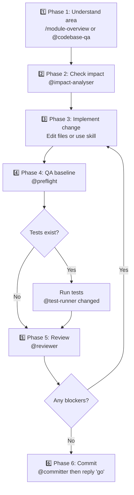
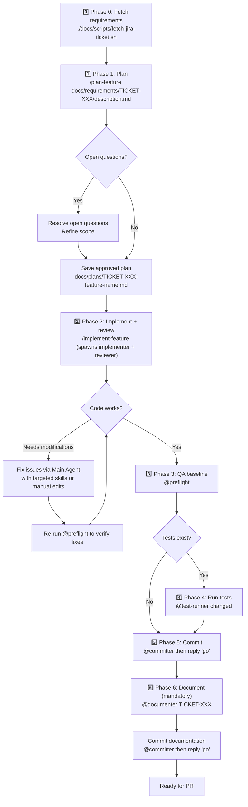

# Feature Development Workflow

> From Jira ticket to merged PR — how to use the AI tooling effectively for both simple and complex features.

For canonical agent and skill definitions, use [`../03-reference/ai-tools-reference.md`](../03-reference/ai-tools-reference.md).

---

## Quick decision guide

| Feature scope                                  | Recommended path                            |
| ---------------------------------------------- | ------------------------------------------- |
| Single-file change or minor UI tweak           | [Direct → QA → Commit](#simple-features)    |
| New React component inside an existing widget  | `/react-new-widget` or `/react-form-wizard` |
| New GraphQL operation (any scope)              | `/gql` (auto-detects PHP vs React-only)     |
| Magento plugin or interceptor                  | `/plugin`                                   |
| Magento event observer                         | `/observer`                                 |
| Theme template/layout override                 | `/create-theme-override`                    |
| DOM bridge hook for Magento JS ↔ React        | `/react-dom-hook`                           |
| Admin-configurable settings (system.xml)       | `/admin-config`                             |
| New DB column, table, or EAV attribute         | `/data-patch`                               |
| Transactional emails (confirmation + internal) | `/email-template`                           |
| New feature spanning multiple layers           | [Full workflow](#complex-features)          |

---

## Simple features



For changes contained within 1–3 files or a well-understood area. It is a workflow that combines the use of skills and agents.

### Phase 1 — Understand

```
/module-overview <VendorNamespace>_<Module>
— or —
@codebase-qa How does [thing] work?
```

Use these to quickly understand the module boundary and existing implementation pattern before editing.

### Phase 2 — Check impact

```
@impact-analyser [file or type you're about to change]
```

Run impact analysis before touching files so you catch cross-layer dependencies early.

### Phase 3 — Implement

Edit files directly, or use a skill for the feature type you're implementing.

### Phase 4 — QA

```
@preflight
```

Run full checks after implementation. For tests (if test infrastructure is set up):

```
@test-runner changed
```

### Phase 5 — Review

```
@reviewer
```

Review the branch diff and fix any blockers before committing.

### Phase 6 — Commit

```
@committer
```

The committer proposes a logical commit plan. Review it, then reply `"go"` to execute.

---

## Complex features



Use this path for features spanning multiple layers (for example: PHP module work, GraphQL schema/resolvers, React widgets, and email flows). It is an agent-first workflow, with each phase mapped to a dedicated agent or skill.

**Model allocation principle — "Opus reasons, Sonnet reads":** Research agents (`codebase-qa`, `impact-analyser`) and mechanical agents (`preflight`, `committer`, `test-runner`) run on Sonnet for speed and cost efficiency. Reasoning-heavy agents (`feature-planner`, `feature-implementer`, `reviewer`, `documenter`) run on Opus for higher-quality output.

### Phase 0 — Fetch requirements

```bash
./docs/scripts/fetch-jira-ticket.sh <TICKET-ID>
```

Fetches the full Jira ticket (description, comments, and all attachments including mockup images) into `docs/requirements/<TICKET-ID>/`. This step ensures the planner has access to UI mockups for correct layout placement — not just the text description.

Credentials are read from `.env.development` (`JIRA_EMAIL` and `JIRA_API_TOKEN`). See `.env.development.example` for the format. You can also pass credentials explicitly: `./docs/scripts/fetch-jira-ticket.sh <email> <token> <TICKET-ID>`.

### Phase 1 — Plan

```
/plan-feature docs/requirements/<TICKET-ID>/description.md
```

The `/plan-feature` skill orchestrates the full planning workflow: it spawns `codebase-qa` sub-agents to research how reference features implement the needed patterns, spawns `impact-analyser` sub-agents to assess ripple effects on shared files, then passes all findings to the `@feature-planner` agent. The planner synthesizes the research into a file-by-file implementation plan ordered by layer — and can read mockup images in `docs/requirements/<TICKET-ID>/attachments/` for UI placement context. Save its output to `docs/plans/TICKET-XXX-feature-name.md`.

> **Before implementing — comprehension checkpoint:** Don't just resolve open questions. Verify you can explain the feature's data flow end-to-end from the plan: how user input enters, crosses layers, gets processed, and returns. If you can't, use `@codebase-qa` to fill gaps before proceeding. Approving a plan you don't understand leads to comprehension debt (see `05-concepts/knowledgebase-comprehension-debt.md`).

### Phase 2 — Implement and review

```
/implement-feature docs/plans/TICKET-XXX-feature-name.md
```

The `/implement-feature` skill orchestrates the full implementation workflow in four phases:

1. **Validates the plan** — checks for unresolved open questions (`TODO`, `TBD`, `?` markers)
2. **Spawns `@feature-implementer`** in an isolated git worktree — writes all files, runs type-check/lint/build, produces a change summary
3. **Spawns `@reviewer`** to review the implementation — detects whether the worktree still exists or changes landed in the main working directory, and directs the reviewer accordingly
4. **Reports combined results** — change summary, verification results, checklist progress, code review findings, and key files to understand

The review feedback is **informational output for the user** — it does not trigger automated fixes. You decide which findings to address and how.

> The output includes a **"Key files to understand"** list — read those files and trace the primary data flow yourself before moving on. The review checks correctness, but only you can verify that you understand what was built. See `05-concepts/knowledgebase-comprehension-debt.md`.

### Phase 3 — QA

```
@preflight
```

Runs the full preflight suite across both layers:

- React: ESLint, TypeScript type-check, Vite production build, focused a11y audit on changed components
- PHP: PHPCS (Magento2 standard) and PHPStan (level 0)

Fix any reported issues before committing.

If you only need one stack while iterating:

```
/preflight react   # React-only checks
/preflight php
```

### Phase 4 — Run tests (if applicable)

```
@test-runner changed
```

Run after preflight and before committing. The `@test-runner` agent runs tests for changed files only. If no test infrastructure exists yet, this phase can be skipped — but consider running `/react-add-tests setup` to bootstrap Vitest for future work.

### Phase 5 — Commit

```
@committer
```

The committer analyses all uncommitted changes, reads the modified files to understand their layer, and proposes a logical breakdown into ordered commits following the message format from CLAUDE.md → Commit Conventions (typically `TICKET-XXX: Verb phrase`). Review the proposed plan, then reply `"go"` to execute.

### Phase 6 — Document (mandatory)

```
@documenter TICKET-XXX
```

**This phase is not optional.** Every complex feature must have an architecture document before the PR is created. Without it, future developers (and AI agents) have no way to understand the feature's design without re-reading every file.

The documenter reads the code on the current branch and generates `docs/features/TICKET-XXX-feature-name.md`. The document includes Mermaid diagrams, module structure, data flows, admin configuration, and deployment steps. Review the generated document, resolve any `[TODO: verify]` items, and commit it as a final commit on the branch.

---

## Skills for specific feature types

### New React widget

```
/react-new-widget my-feature
```

Creates `widgets/my-feature-widget.tsx` and a component directory. Prompts you to confirm the Magento integration (PHTML + layout XML) before creating those files.

### Multi-step form wizard

```
/react-form-wizard HireForm
```

Scaffolds the full FormWizard structure following the project's existing multi-step form patterns (see CLAUDE.md Reuse table): main form component, individual step components with Zod validation, and GQL types. Asks for step count and field definitions.

### GraphQL operation

```
/gql productAvailability
```

Auto-detects whether the PHP schema already defines the operation. If it does, creates just the React data layer (GQL file, provider method, TypeScript types). If not, also scaffolds the `schema.graphqls` additions and resolver — showing the proposed schema changes before writing.

### Magento plugin

```
/plugin Magento\Catalog\Model\Product::getPrice
```

Reads the vendor class, determines the correct plugin type (`before`/`after`/`around`), creates the plugin class in the right module, and registers it in `di.xml`.

### Theme template/layout override

```
/create-theme-override Magento_Catalog/catalog/product/view.phtml
```

Finds the original in vendor, copies it to the theme directory, shows the original content, and waits for your instructions before modifying it.

### DOM bridge hook

```
/react-dom-hook ConfigurablePrice
```

Creates a `useConfigurablePrice.ts` hook using MutationObserver to bridge Magento's vanilla JS DOM mutations into React state, following the `useConfigurableOptions` pattern.

---

## Documenting what you built

After implementing a significant feature, create a feature document:

```
docs/features/TICKET-XXX-feature-name.md
```

Include:

- Architecture overview (Mermaid diagram recommended)
- Data flow for key operations (form submission, GraphQL queries, email)
- Admin configuration paths
- Deployment steps

See existing files in `docs/features/` for examples.

---

## Branch and commit conventions

| Item               | Convention                                                          |
| ------------------ | ------------------------------------------------------------------- |
| Branch name        | `feature/TICKET-XXX-short-description` or `bugfix/TICKET-XXX-description` |
| Commit message     | `TICKET-XXX: Verb phrase describing the change`                           |
| Commit granularity | One logical unit per commit — the `committer` agent handles this          |
| Base branch        | See CLAUDE.md → Commit Conventions for the main branch name               |

The `committer` agent extracts the ticket number from the branch name automatically.
